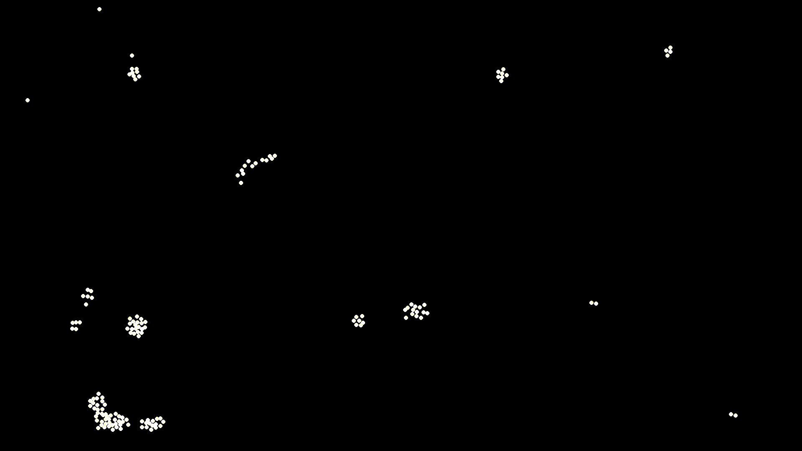

# Boid's Flocking Algorithm/Simulation

## Introduction

The purpose of this project is to impliment the boid algorithm, and simulate it in a realtime environment. The boid algorithm is an algorithm is more a set of rules which together form emergent behavior which simulates the flocking behavior of birds. With the program getting its name from bird-like object. The three rules relate an individual bird to the overall flock.
